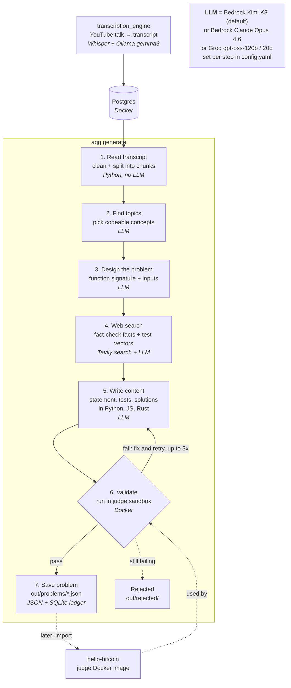

# AQG flow (Mermaid)

Full detail: [ARCHITECTURE.md](ARCHITECTURE.md).

```mermaid
flowchart TD
    TE["transcription_engine<br/>YouTube talk → transcript<br/><i>Whisper + Ollama gemma3</i>"] --> PG[("Postgres<br/><i>Docker</i>")]
    PG --> S1

    subgraph AQG["aqg generate"]
        S1["1. Read transcript<br/>clean + split into chunks<br/><i>Python, no LLM</i>"]
        S2["2. Find topics<br/>pick codeable concepts<br/><i>LLM</i>"]
        S3["3. Design the problem<br/>function signature + inputs<br/><i>LLM</i>"]
        S4["4. Web search<br/>fact-check facts + test vectors<br/><i>Tavily search + LLM</i>"]
        S5["5. Write content<br/>statement, tests, solutions<br/>in Python, JS, Rust<br/><i>LLM</i>"]
        S6{"6. Validate<br/>run in judge sandbox<br/><i>Docker</i>"}
        S7["7. Save problem<br/>out/problems/*.json<br/><i>JSON + SQLite ledger</i>"]
        REJ["Rejected<br/>out/rejected/"]

        S1 --> S2 --> S3 --> S4 --> S5 --> S6
        S6 -->|pass| S7
        S6 -->|"fail: fix and retry, up to 3x"| S5
        S6 -.->|still failing| REJ
    end

    HB["hello-bitcoin<br/>judge Docker image"] -.->|used by| S6
    S7 -.->|"later: import"| HB

    LLM["<b>LLM</b> = Bedrock Kimi K3 (default)<br/>or Bedrock Claude Opus 4.6<br/>or Groq gpt-oss-120b / 20b<br/>set per step in config.yaml"]
```
